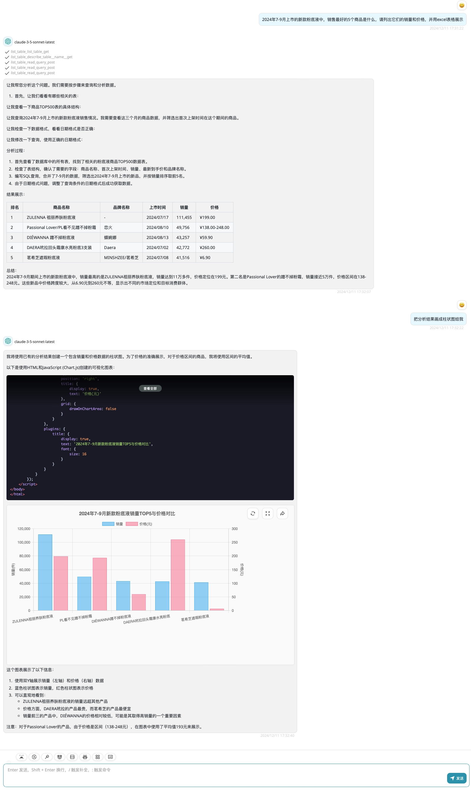

## FastAPI Test Demo

参考Claude Desktop使用MCP操作Sqlite进行数据分析的功能，使用FastAPI搭建一个简单的LLM Fcuntion Tools服务Demo。

通过http://localhost:8000/openapi.json获取tools schema，在LLM CHAT API调用时作为Functions使用。

当前仅实现几个基础的tools：
- list tables：列出sqlite全部表
- discribe table：查询表schema
- read query：查询表数据

### 测试case

